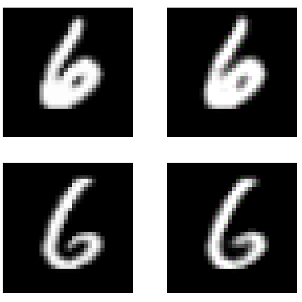
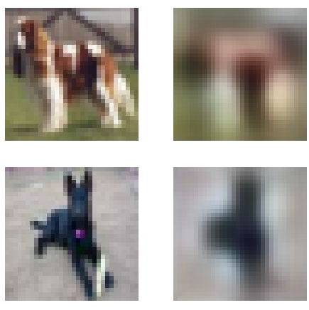
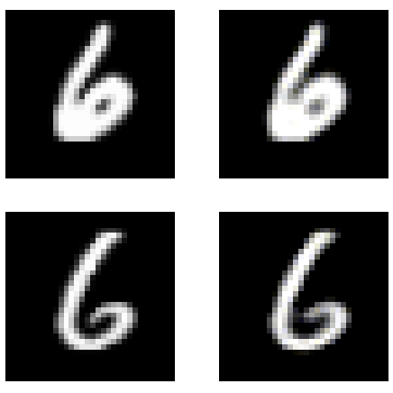

# Applying Modern Best Practices to Autoencoders

## Contents
1. [Introduction](#Introduction)
2. [Autoencoder Training Techniques](#Autoencoder-Training-Techniques)
3. [The Code](#The-Code)
4. [Results](#Results)
5. [Full Report Link](#Full-Report)

## Introduction
An _autoencoder_ is a neural network which learns to recreate its input usually through some bottleneck. Autoencoders have been an interest in research in deep learning since the 80s [1]. Creating a bottleneck means that autoencoders are built for dimensionality reduction, however have also been used for anomaly detection [2], neural network pretraining [3] and more.


An autoencoder can be thought of in two parts, an encoder and a decoder [1], the encoder takes in the input data and outputs a lower dimensional representation. The decoder takes as input the lower representation and outputs the original input.

This can be thought of as two functions:

```python
input = x
encoded = z

f(x) = z
g(z) = x
```
The aim is to learn functions f and g.

### References
[1] Ian Goodfellow, Yoshua Bengio and Aaron Courville. _Deep Learning_. MIT Press, 2016. http://www.deeplearningbook.org

[2] Chong Zhou and Randy C. Paffenroth. _Anomaly Detection with Robust Deep Autoencoders_. 2017. Proceedings of the 23rd ACM SIGKDD International Conference on Knowledge Discovery and Data Mining, pp. 665-674. DOI: 10.1145/3097983.3098052.

## Autoencoder Training Techniques
The following modern best practices have been applied to autoencoders:
- Pixel Shuffle
- Transfer Learning
- Progressive Resizing
- Feature Loss

## The Code
### Data
The data used for this project is the [Cifar-10](https://www.cs.toronto.edu/~kriz/cifar.html) dataset and the [MNIST](http://yann.lecun.com/exdb/mnist/) dataset.

Notebooks were all wrote using [Google Colab](https://colab.research.google.com/notebooks/welcome.ipynb).

### Notebooks
Notebooks are split into two folders, the notebooks for cifar10 and the notebooks for MNIST, you can find these [here](notebooks/cifar10) and [here](notebooks/mnist) respectively.

### Models
Models used in the notebooks can be found in the .py files [here](resnet_autoencoder_training)

## Results
All results are based on the testing data supplied by the datasets, and so this data has been unseen by the model in training. Each model was trained for a total of 15 epochs.

Optimal learning rates for each model were found through calculating the loss with different learning rates for a batch from the dataset. This means that different models require different learning rates. Using the same learning rate for all would not be a fair assessment due to some models have more parameters to learn.
### MNIST
| Method        | MAE           | MSE   | Classifier Accuracy | Training Time |
| :-----------: |:-------------:| :----:|:-------------------:| :--------:|
| Original Image | n/a | n/a | 0.9912 | n/a |
| Baseline      | ........ | **0.000854** | **0.9900** | 24m 43s |
| Pixel Shuffle | 0.011906 | 0.001174 | 0.9870 | 27m 40s |
| Progressive Resizing | 0.011891 | 0.001168 | 0.9877 | 24m 44s |
| Pretraining | 0.018001 | 0.003003 | 0.9804 | 25m 12s |
| Resnet w/o pretrain | 0.018034 | 0.003589 | 0.9654 | 25m 30s |
| Feature Loss | 0.075097 | 0.011058 | 0.9886 | 26m 52s |

### Cifar10
| Method        | MAE           | MSE   | Classifier Accuracy | Training Time |
| :-----------: |:-------------:| :----:|:-------------------:| :--------:|
| Original Image | n/a | n/a | 0.8179 | n/a |
| Baseline      | 0.046274 | 0.004345 | 0.4558 | 23m 47s |
| Pixel Shuffle | 0.046642 | 0.004385 | 0.4759 | 27m 6s |
| Progressive Resizing | **0.046132** | 0.004310 | 0.4608 | 23m 5s |
| Pretraining | 0.076558 | 0.011385 | 0.2333 | 24m 12s |
| Resnet w/o pretrain | 0.075097 | 0.011058 | 0.2236 | 26m 6s |
| Feature Loss | 0.046206 | **0.004301** | **0.6209** | 28m 34s |

The best model for the MNIST dataset was the _baseline_ model for all three measurements. For the Cifar-10 dataset, the best model for MSE and Classifier Accuracy was the _Feature Loss_ model, however the _Pixel Shuffle_ model achieved the lowest MAE. Overall making the Feature Loss model the best for Cifar-10.

### Baseline


### Feature Loss



### Pretraining
#### Pretrained Weights



#### Resnet Model


### Pixel Shuffle



### Progressive Resizing


# Full Report
There is a full report explaining each method and training technique as well as a dicussion of the results available [here as a pdf] and [here on my website].
