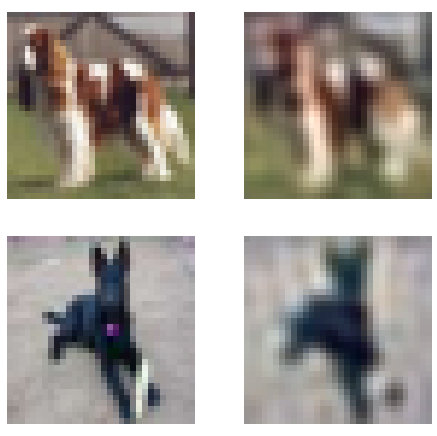
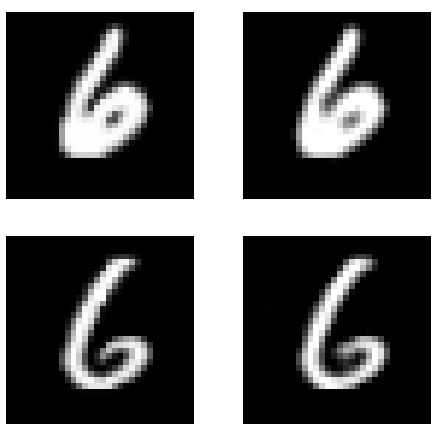
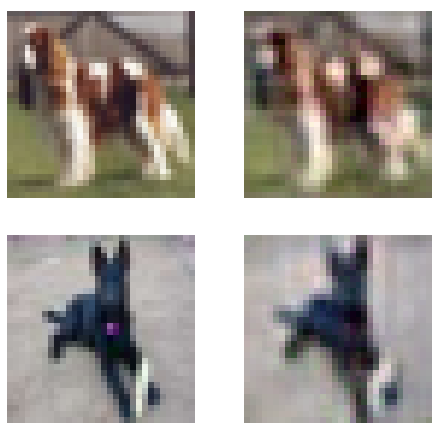
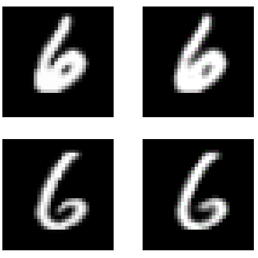
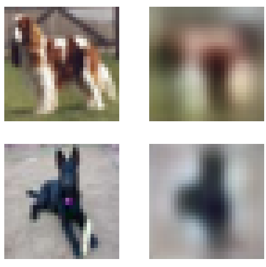
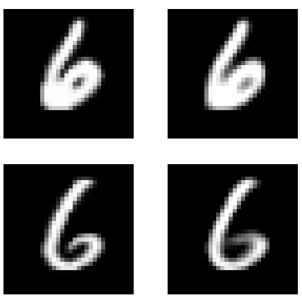
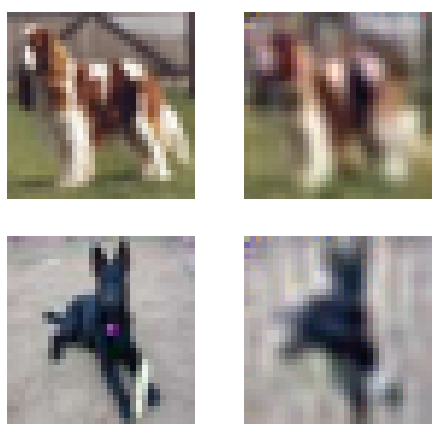
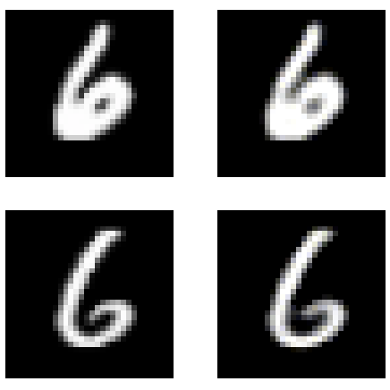
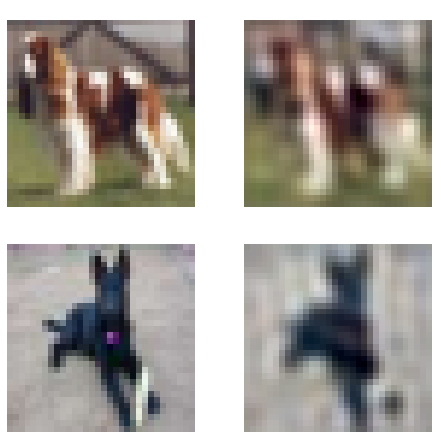
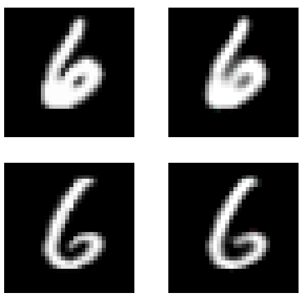

# Experiment
All experiments were run on [Google Colab](https://colab.research.google.com/notebooks/welcome.ipynb) using an assigned GPU at that time, this could mean some models may have used a better GPU than other models, however this will only have an effect on time taken and not the outputs.

Due to using a free online GPU provided by Google, amount of training is minimal (while still providing good results) as to not take advantage or exploit this product.

## Models

A total of 6 models will be trained and analysed. The _baseline model_ using mean squared error (MSE) loss, the _pixel shuffle model_ using MSE loss, the baseline model using _progressive resizing_ and MSE loss, the _pretrained model_ both _with_ and _without_ pretrained weights (called Pretrained and Resnet from now on) with an MSE loss and finally the baseline model using a _Feature Loss_ calculated from the VGG16 model.

## Measures
Three measures of accuracy will be used to compare models. Mean squared error, mean absolute error and _classification accuracy_.

To calculate classification accuracy, an image classifier is trained on the original images, then the autoencoded images are ran through to see if the model will still the predict the same. This means that if the encoded and decoded image holds enough information from the original image a similar classification accuracy will be seen. This will mean that recreation of the image is not just important but also content of the image.

Comparing both MAE and MSE can allow us to see which models have more anomalous outputs (which will be represented in the MSE).

## Results
All results are based on the testing data supplied by the datasets, and so this data has been unseen by the model in training. Each model was trained for a total of 15 epochs.

Optimal learning rates for each model were found through calculating the loss with different learning rates for a batch from the dataset. This means that different models require different learning rates. Using the same learning rate for all would not be a fair assessment due to some models have more parameters to learn.
### MNIST
| Method        | MAE           | MSE   | Classifier Accuracy | Training Time |
| :-----------: |:-------------:| :----:|:-------------------:| :--------:|
| Original Image | n/a | n/a | 0.9912 | n/a |
| Baseline      | ........ | **0.000854** | **0.9900** | 24m 43s |
| Pixel Shuffle | 0.011906 | 0.001174 | 0.9870 | 27m 40s |
| Progressive Resizing | 0.011891 | 0.001168 | 0.9877 | 24m 44s |
| Pretraining | 0.018001 | 0.003003 | 0.9804 | 25m 12s |
| Resnet w/o pretrain | 0.018034 | 0.003589 | 0.9654 | 25m 30s |
| Feature Loss | 0.075097 | 0.011058 | 0.9886 | 26m 52s |

### Cifar10
| Method        | MAE           | MSE   | Classifier Accuracy | Training Time |
| :-----------: |:-------------:| :----:|:-------------------:| :--------:|
| Original Image | n/a | n/a | 0.8179 | n/a |
| Baseline      | 0.046274 | 0.004345 | 0.4558 | 23m 47s |
| Pixel Shuffle | 0.046642 | 0.004385 | 0.4759 | 27m 6s |
| Progressive Resizing | **0.046132** | 0.004310 | 0.4608 | 23m 5s |
| Pretraining | 0.076558 | 0.011385 | 0.2333 | 24m 12s |
| Resnet w/o pretrain | 0.075097 | 0.011058 | 0.2236 | 26m 6s |
| Feature Loss | 0.046206 | **0.004301** | **0.6209** | 28m 34s |

The best model for the MNIST dataset was the _baseline_ model for all three measurements. For the Cifar-10 dataset, the best model for MSE and Classifier Accuracy was the _Feature Loss_ model, however the _Pixel Shuffle_ model achieved the lowest MAE. Overall making the Feature Loss model the best for Cifar-10.

## Discussion
The first thing to note that due to the _simplicity_ of the MNIST images, it appears that any of the new training techniques becomes overkill for the MNIST images and the baseline (most simple) model works best for this dataset. Due to this it is hard to do a comparison of the techniques apart from saying that for simple images only a simple model is required.

The conclusion from the MNIST dataset is however that images of size 3x32x32=3072 (the input size) can be cut down to an array of size 1000, meaning these images can be stored at 1/3rd of the size and still achieve a similar accuracy on a classifier (0.9912 compared to 0.9900). However an issue with this is that the original images are of size 1x32x32 and are extended to 3x32x32 to make the models comparable between both datasets. This means the images are not compressed as much as it seems if you take the size of the original images (1024 pixels).

When looking at the Cifar-10 results, it can be seen the more complex methods become more beneficial for more complex images. However, the results are still far from perfect. The best measure to see the "usability" of the model is the classifier accuracy as this shows how the images can still be recognised. Looking at this assessment Feature Loss was the best technique which shows when using an autoencoder trying to recreate features is better than trying to recreate each individual pixel.

The downside to using the Feature Loss model is the time it takes to train, taking over 5 minutes longer than the shortest training time for Cifar-10. However, when compared to other methods it shows the extra training is worth it as the next highest classifier accuracy is as low as 0.4759.

The next subsections will show testing set images for each model and discuss what was learned from using each technique. Each image has the input on the left and the model output on the right.

### Baseline

The baseline images for Cifar10 are too blurred and unusable as an autoencoder.
### Feature Loss

When training the Feature Loss model the VGG16 model was used. What was found was that the best way to weight features was to compare with earlier parts of the model and slowly decrease the weighting. This suggests that for autoencoders the most important features are found in the earlier layers, as mentioned before this is due to the first few parts to image classifiers being edge detectors. Detecting these basic features allows shapes of objects to be recreated with less blur than when performing pixel to pixel loss functions.

This is compared to using the middle layers in models such as [DeOldify](https://github.com/jantic/DeOldify) which are looking for more complex features such as fur on animals.

Using the middle to last layers in the autoencoders proved to not be effective and looked to _force_ features into the image which were not actually in the image. Perhaps more work could be done into this to make it work effectively.

### Pretraining
#### Pretrained Weights

Pretrained weights proved to be ineffective when creating an autoencoder, this is due to the complexity of the encoder (resnet). The initial idea was that a model used to identify objects and classify images would be effective as it would be able to recreate features in the image.

The resulting images do appear to separate objects from the background, however both the object and background are a blur and so it is unusable. However this could still mean the encoder is effective for other use cases such as unsupervised learning. The output of the encoder from this autoencoder could be  clustered on to see if images are able to split into classes.

#### Resnet Model

Similarly with the resnet encoder (without using the pretrained weights), similar results are found suggesting this encoder is just too complex when trying to create an autoencoder.

Again, like above the encoder could be looked into more.

### Pixel Shuffle

Pixel shuffle achieves better results in certain situations when measuring with MSE. When looking for visually pleasing images, it achieves similar to the upsampling technique except contains "defects" instead of blur. Overall this gives a less visually pleasing result. Features in the image are slightly more easy to see when compared to the baseline however overall it is still unusable.

### Progressive Resizing

Progressive resizing was effective in reducing training time while also achieving similar results to the baseline model, which suggests this is an effective technique to reduce overall training time.

What is not covered here is the generalisation of the models to differing image sizes, using progressive resizing could force the model to learn more general weights which work for all image sizes, whereas for all the other models the training data was only 32 by 32 images which may not work on other sizes.

# Conclusion
Overall when attempting to use an autoencoder as a compression system, visual pleasing results are difficult to achieve with images. However this report has shown that achieving the best results in being able to classify an image after encoding and decoding it that pixel to pixel loss is not the best and in fact training the model to try and recreate features in the image is more important.

One drawback to this report is the lack of resources to really train these models and 15 epochs was the max for each model. Perhaps after 100 epochs we could start to see even larger differences and notice the effect of each individual technique more.

One aspect of an autoencoder that was not mentioned here was the information held in the encoder. In many situations the encoded format is the most important part and so it is best to optimise this instead of the overall output from the autoencoder.

## Further Research
Below I list some topics which could be looked into further to see the effects.
- Combinations of techniques used here (ie featureloss + pixel shuffle etc)
- Does progressive resizing lead to a more general results for different image sizes
- Use of similar models on larger images such as those from ImageNet
