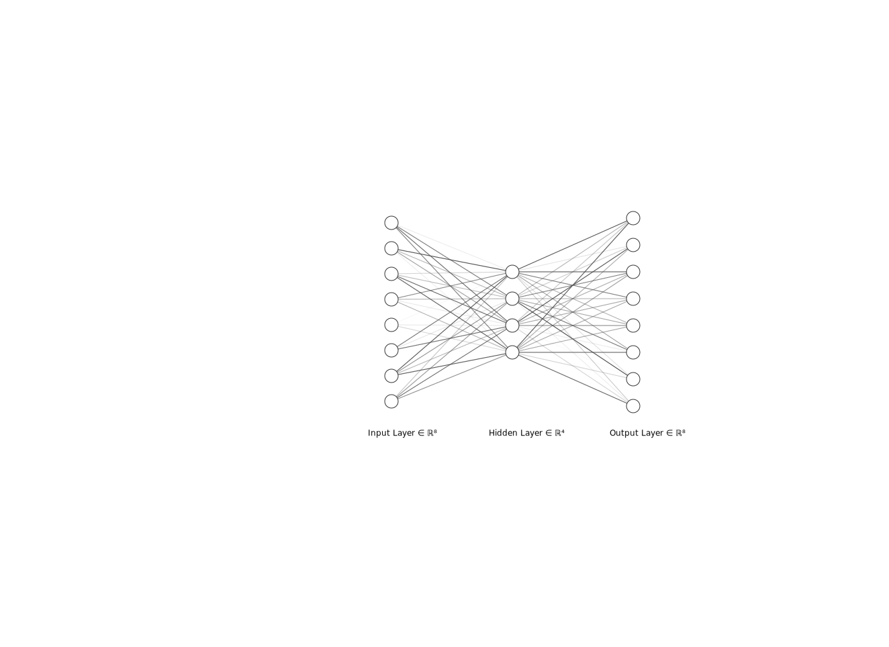

# Introduction
An _autoencoder_ is a neural network which learns to recreate its input usually through some bottleneck. Autoencoders have been an interest in research in deep learning since the 80s [1]. Creating a bottleneck means that autoencoders are built for dimensionality reduction, however have also been used for anomaly detection [2], neural network pretraining [3] and more.

An autoencoder can be thought of in two parts, an encoder and a decoder [1], the encoder takes in the input data $\mathbf{x}_{i}$ and outputs a lower dimensional representation, call this $\mathbf{z}_{i}$. The decoder takes as input $\mathbf{z}_{i}$ and outputs the original input $\mathbf{x}_{i}$.

Putting this all together we have two functions, $f$ and $g$:
$$f(\mathbf{x}) \mapsto \mathbf{z}$$

$$g(\mathbf{x}) \mapsto \mathbf{x}$$

This report is going to discuss some of the modern best practices found in other parts of image data research such as image classification and super-resolution and then apply them to autoencoders.

# References
[1] Ian Goodfellow, Yoshua Bengio and Aaron Courville. _Deep Learning_. MIT Press, 2016. http://www.deeplearningbook.org

[2] Chong Zhou and Randy C. Paffenroth. _Anomaly Detection with Robust Deep Autoencoders_. 2017. Proceedings of the 23rd ACM SIGKDD International Conference on Knowledge Discovery and Data Mining, pp. 665-674. DOI: 10.1145/3097983.3098052.

[3] Dumitru Erhan, Yoshua Bengio, Aaron Courville, Pierre-Antoine Manzagol, Pascal Vincent and Samy Bengio. _Why Does Unsupervised Pre-training Help Deep Learning?_. Journal of Machine Learning Research 11 (2010), pp. 625-660.
