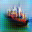

# Pixel Shuffle
Traditional methods of upsampling neural networks used _transposed convolutions_, these act as a reverse to convolutional layers with stride or make pooling layers. Using a convolution with stride or followed by maxpooling is called _downsampling_, the reverse for this performed in transpose layers is called _upsampling_. As can be seen in the illustration created by [1] in [figure 1] is that the upsampling has to fill in a lot of gaps, we are essentially using a small point in an image to create a bigger point in a bigger image.

no_padding_strides_transposed_single-1.png


When kernel sizes are not divisible by the stride we start to see overlap [2], this is where "checkerboard artifacts" come from. As can be seen in [figure 2] and [figure 3] from [2] and [1] respectively.




To combat this issue of "checkerboard artifacts", [2] suggests the use of separating upsampling and convolutions, and using a a computation such as nearest-neighbor based resizing followed by a convolution.

_Pixel Shuffle_ is another technique for upsampling and was introduced in [3]. As noticed in [2], it is equivalent to a transposed convolution when ensuring the kernel size can be divided by the stride. This gives an even overlap, reducing checkboard artefacts.

The pixel shuffle algorithm is silghtly more complex and it best described in a image. It works by the follow:

```python
input_image = (H x W x C)
```
Perform convolution to have output:
```python
convolution_output = (H x W x s^2C)
```
Then reshape this to:
```python
pixel_shuffle_output = (sH x sW x C)
```
This can be visualised in figure ....

# References
[1] Vincent Dumoulin and Francesco Visin. _A guide to convolution arithmetic for deep learning_. arXiv, 2016. arXiv:1603.07285.

[2] Augustus Odena, Vincent Dumoulin and Chris Olah. _Deconvolution and Checkerboard Artifacts_. Distill, 2016. http://distill.pub/2016/deconv-checkerboard

[3] Wenzhe Shi, Jose Caballero, Ferenc Huszár, Johannes Totz, Andrew P. Aitken, Rob Bishop, Daniel Rueckert and Zehan Wang _Real-time single image and video super-resolution using an efficient sub-pixel convolutional neural network_. 2016. Proceedings of the IEEE Conference on Computer Vision and Pattern Recognition, pp. 1874—1883. DOI: 10.1109/cvpr.2016.207
